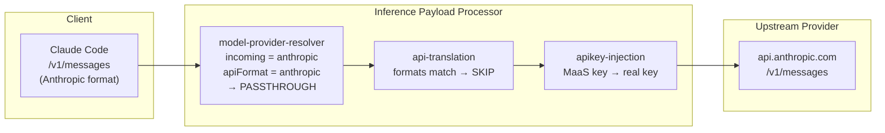
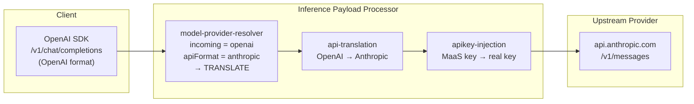
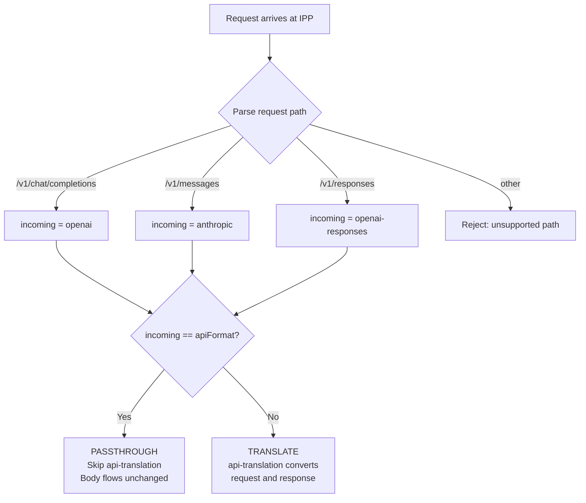

# Design: Multi-Provider API Passthrough for External Model Serving

## Status

Draft — June 2026

## Authors

Inference Gateway Team

## Problem Statement

Today, the Inference Payload Processor (IPP) assumes all client requests arrive in OpenAI `/v1/chat/completions` format. When the upstream provider also speaks a different format (e.g., Anthropic `/v1/messages`), the `api-translation` plugin translates the request from OpenAI → provider-native and the response from provider-native → OpenAI.

This works when the **client** always speaks OpenAI. But increasingly, clients speak their provider's native format directly:

- **Claude Code** (Anthropic's CLI) sends requests in Anthropic Messages format (`/v1/messages`)
- **OpenAI Codex** sends requests in OpenAI Responses format (`/v1/responses`)
- **aider** with Gemini sends requests in Google's format

When a client already speaks the same format as the upstream provider, translation is unnecessary and harmful — it can strip provider-specific fields (e.g., `anthropic-beta` headers, caching directives, extended thinking parameters) that have no OpenAI equivalent.

## Proposed Solution

### Passthrough Mode

Add the ability for the IPP to detect the incoming client API format from the request path and compare it with the upstream provider's API format (declared in the `ExternalProviderRef.apiFormat` field). When they match, the request and response flow through untouched — no translation.

```
Client (Anthropic format) → IPP detects "/v1/messages" → incoming = "anthropic"
                           → ExternalModel.apiFormat = "anthropic" → MATCH → passthrough
                           → request body flows to upstream unchanged
                           → response body flows to client unchanged

Client (OpenAI format)    → IPP detects "/v1/chat/completions" → incoming = "openai"
                           → ExternalModel.apiFormat = "anthropic" → MISMATCH → translate
                           → api-translation converts OpenAI → Anthropic (existing behavior)
```

### Format Detection

The incoming client format is detected from the request path suffix:

| Path suffix | Detected format |
|-------------|----------------|
| `/v1/chat/completions` | `openai` |
| `/v1/messages` | `anthropic` |
| `/v1/responses` | `openai-responses` |

This is deterministic and requires no configuration — the path uniquely identifies the API contract.

### CycleState Flow

The model-provider-resolver plugin writes two new keys to CycleState:

- `incoming-api-format` — detected from request path (e.g., `"anthropic"`)
- `api-format` — from `ExternalProviderRef.apiFormat` on the ExternalModel CR (e.g., `"anthropic"`)

The api-translation plugin reads both keys. If they match, it returns early (passthrough). If they differ, it translates as before.

### Data Model

**No CRD schema changes required.** The existing `ExternalProviderRef.apiFormat` field (added in RHAISTRAT-1720) already declares the upstream format. The incoming format is auto-detected from the request path.

The `externalModelInfo` struct in the IPP's in-memory store gains one field:

```go
type externalModelInfo struct {
    provider        string
    targetModel     string
    apiFormat       string  // NEW — from ExternalProviderRef.apiFormat
    secretName      string
    secretNamespace string
}
```

## Architecture

### Passthrough Flow (formats match — no translation)



### Translation Flow (formats differ — translate as before)



### Decision Flow



## Changes Required

### IPP (ai-gateway-payload-processing)

| Component | Change |
|-----------|--------|
| `pkg/plugins/common/state/state-keys.go` | Add `APIFormatKey` and `IncomingAPIFormatKey` constants |
| `pkg/plugins/model-provider-resolver/store.go` | Add `apiFormat` field to `externalModelInfo` |
| `pkg/plugins/model-provider-resolver/external_model_reconciler.go` | Populate `apiFormat` from CRD (legacy: defaults to provider name) |
| `pkg/plugins/model-provider-resolver/plugin.go` | Detect incoming format from path, accept `/v1/messages` and `/v1/responses`, write both format keys to CycleState |
| `pkg/plugins/api-translation/plugin.go` | Skip translation when `incomingFormat == apiFormat` |

### MaaS (models-as-a-service) — Required for Production

| Component | Change | Why |
|-----------|--------|-----|
| MaaS AuthPolicy template | Add `api-keys-via-xapikey` authentication method | Claude Code sends API key in `x-api-key` header (Anthropic SDK convention), not `Authorization: Bearer` |
| MaaS AuthPolicy template | Update `apiKeyValidation` expression to extract from `x-api-key` | Key validation must check both header locations |
| MaaS HTTPRoute generation | Add `URLRewrite` filter with `ReplacePrefixMatch: /` | Provider APIs must receive clean paths (`/v1/messages`), not MaaS-prefixed paths (`/llm/model-name/v1/messages`) |

Until these MaaS changes ship, passthrough requires manual AuthConfig patches and operators scaled to 0 to prevent reconciliation overwrite.

### BBR Framework (llm-d-inference-payload-processor) — Upstream PR

| Component | Change | Why |
|-----------|--------|-----|
| `pkg/handlers/response.go` | Parse SSE streaming responses | Extract usage data from Anthropic `message_delta` and OpenAI `response.completed` SSE events |
| `pkg/handlers/server.go` | Acknowledge non-EoS response body chunks | Envoy blocks on unacknowledged chunks in streaming mode |

Tracked in upstream PR #138.

## Backward Compatibility

- **Fully backward compatible.** Existing OpenAI-only deployments are unaffected.
- If `IncomingAPIFormatKey` is not set in CycleState (e.g., older model-provider-resolver version), api-translation behaves exactly as before.
- The `apiFormat` field defaults to the provider name for legacy `maas.opendatahub.io` CRDs, which is the existing behavior.

## Testing

1. **Unit tests** — format detection function, passthrough skip logic, CycleState propagation
2. **Integration tests** — Anthropic passthrough (client=anthropic, upstream=anthropic → no translation), OpenAI Responses passthrough, mixed mode (client=openai, upstream=anthropic → translation activates)
3. **E2E** — Deploy with both api-translation and model-provider-resolver plugins, send Claude Code requests to Anthropic ExternalModel, verify response is native Anthropic format (not translated to OpenAI)

## Out of Scope

- Model override / targetModel rewriting (tracked separately)
- Parameter stripping for cross-model compatibility (tracked separately)
- External metering / usage tracking (separate PR)
- Request/response format translation for new providers (existing api-translation scope)
- Unified entry point / body-based routing (RHAISTRAT-1540)
